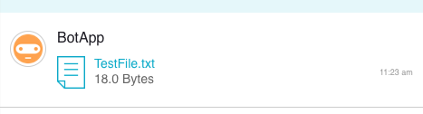

# Avaamo Java Bot SDK

#### Download and add library
Avaamo Java Bot SDK is a single jar file. You can download it here

The java sdk requires the following 3 libraries as dependencies.

* javaee-api-7.0.jar [ Download ](https://github.com/jbt/markdown-editor)
* javax.json-1.0.4.jar
* tyrus-standalone-client-1.12.jar

#### Receiving Messages

Import Avaamo java package.
```java
import com.avaamo.java.Avaamo;

```
Initialize the library with your BOT UUID and Access Token.

```java
avaamo = new Avaamo(<YOUR-BOT-UUID>, <YOUR-BOT-ACCESS-TOKEN>);

avaamo.addEventHandler(new Avaamo.EventHandler() {
public void handleEvent(String message) {
try{
if (message.contains("phx_reply")){
System.out.println("==> response: "+ message );

}else if (message.contains("read_ack")){
System.out.println("==> read_ack: "+message);
}
else{
System.out.println("==> message: "+message);
}
}catch (Exception error){
System.err.println("Error "+ error.getMessage());
}

}
});
```
#### Sending Messages

```java
// message is the JSON string
avaamo.sendMessage(message)
```

#### Sending an image

```java
Image image = new Image(new File("test_image.jpg"));
image.setCaption("This is the image caption");
avaamo.sendImage(image, cuuid);
```


#### Sending a file

```java
FileAttachment fileAttachment = new FileAttachment(new File("TestFile.txt"));
avaamo.sendFileAttachment(fileAttachment, cuuid);
```


#### Sending a card

```java
CardAttachment cardAttachment = new CardAttachment();
cardAttachment.setTitle("Card Title");
cardAttachment.setDescription("Card Description. This has minimal rich text capabilities as well. For example <b>Bold</b> <i>Italics</i>");
cardAttachment.setURL("http://www.avaamo.com");
cardAttachment.addLink(new CardAttachment.WebpageCardLink("Web URL", "http://www.avaamo.com"));
cardAttachment.addLink(new CardAttachment.SendMessageDeeplink("Post a Message", "Sample Action"));
cardAttachment.addLink(new CardAttachment.SendFormToConversationDeeplink("Open a Form", "63c906c3-553e-9680-c273-28d1e54da050", "Say Yes", null));
cardAttachment.setShowcaseImage(new File("test_image.jpg"));
avaamo.sendCardAttachment(cardAttachment, cuuid);
```
