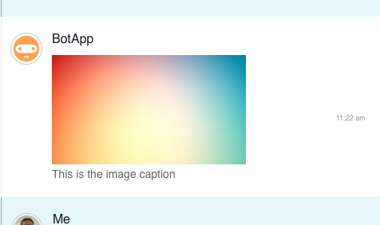
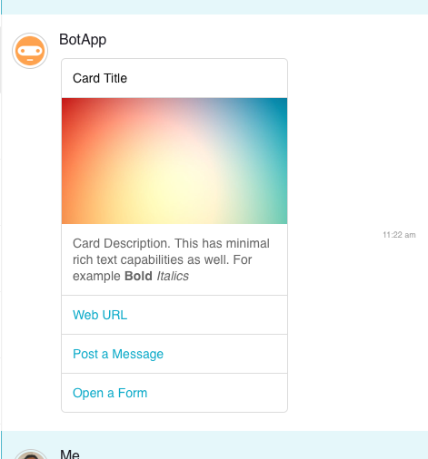

# Avaamo Java Bot SDK

Before start developing a bot you should first create a bot in the Avaamo Dashboard.
Follow the steps in this [Getting Started](https://github.com/avaamo/java/wiki) page to create a bot in the dashboard.

#### Download and add library
Avaamo Java Bot SDK is a single jar file, avaamo.jar. Requires Java SE 8.

[ Download ](https://github.com/avaamo/java/blob/master/avaamo.jar?raw=true) SDK

#### Sample Bot

This [file](https://github.com/avaamo/java/blob/master/SampleBot.java?raw=true) has the full example referred in this page.

#### Receiving Messages

Import Avaamo java package.
```java
import com.avaamo.java.Avaamo;

```
Initialize the library with your BOT UUID and Access Token.

```java
avaamo = new Avaamo(<YOUR-BOT-UUID>, <YOUR-BOT-ACCESS-TOKEN>);

or

avaamo = new Avaamo(<YOUR-BOT-UUID>, <YOUR-BOT-ACCESS-TOKEN>, String proxyUsername, String proxyPassword, String proxyURI)

avaamo.addEventHandler(new Avaamo.MessageHandler() {
	@Override
	public void handleMessage(IncomingMessageModel message) {
		try{
			String content = message.message.content;
			System.out.println("\n==> "+message.user.firstName+": "+ content);					

		}catch (Exception error){
			error.printStackTrace();
			System.err.println("Error processing the message."+ error.getMessage());
		}

	}

	@Override
	public void handleReadAck(ReadAckModel readAckModel) {
		System.out.println("Incoming read ack for message uuid : " + readAckModel.read_ack.message_uuid );
	}

	@Override
	public void handleActivity(Activity activity) {
		System.out.println("Incoming activity from user : " + activity.user.firstName + " " + activity.user.lastName );
	}
});

```
#### Sending Messages

```java
avaamo.sendMessage(message)
```

#### Sending an image

```java
Image image = new Image(new File("test_image.jpg"));
image.setCaption("This is the image caption");
avaamo.sendImage(image, cuuid);
```


#### Sending a file

```java
FileAttachment fileAttachment = new FileAttachment(new File("TestFile.txt"));
avaamo.sendFileAttachment(fileAttachment, cuuid);
```


#### Sending a card

```java
CardAttachment cardAttachment = new CardAttachment();
cardAttachment.setTitle("Card Title");
cardAttachment.setDescription("Card Description. This has minimal rich text capabilities as well. For example <b>Bold</b> <i>Italics</i>");
cardAttachment.addLink(new CardAttachment.WebpageCardLink("Web URL", "http://www.avaamo.com"));
cardAttachment.addLink(new CardAttachment.SendMessageDeeplink("Post a Message", "Sample Action"));
cardAttachment.addLink(new CardAttachment.SendFormToConversationDeeplink("Open a Form", "63c906c3-553e-9680-c273-28d1e54da050", "Say Yes", null));
cardAttachment.setShowcaseImage(new File("test_image.jpg"));
avaamo.sendCardAttachment(cardAttachment, cuuid);
```


#### Downloading a file/image

```java
if(message.message.attachment instanceof FileAttachmentResponse){
	FileAttachmentResponse fileAttachmentResponse = (FileAttachmentResponse)message.message.attachment;
	avaamo.downloadAttachment(fileAttachmentResponse.uuid, new File(fileAttachmentResponse.name));
}
```

#### Downloading and processing a form

```java
if(message.message.attachment instanceof FormAttachmentResponse){
	System.out.println("Incoming form from user: ");
	FormAttachmentResponse formAttachmentResponse = (FormAttachmentResponse) message.message.attachment;
	System.out.println("Downloading form...");
	FormResponse formResponse = formAttachmentResponse.downloadResponse();
	System.out.println("Downloading form complete.");
	for(Question question : formResponse.questions){
		System.out.println(question.title);
		System.out.println(question.reply.getAnswer());
		switch (question.questionType) {
		case AUTO_CHECKIN:
		case LOCATION:
			if(question.reply.replyData instanceof LocationData){
				LocationData locationData = (LocationData) question.reply.replyData;
				System.out.println("Location details: " + locationData.lat + " :: " + locationData.lng);
			}
			break;
		case CHECKLIST:
			if(question.reply.replyData instanceof CheckListData){
				CheckListData checkListData = (CheckListData) question.reply.replyData;
				System.out.println("selected option uuids");
				for(String optionUUID : checkListData.option_uuid){
					System.out.println(optionUUID);
				}
			}
			break;
		case FILE:
		case IMAGE:
		case SIGNATURE:
			if(question.reply.replyData instanceof FileData){
				FileData fileData = (FileData) question.reply.replyData;
				fileData.assetInfo[0].downloadAttachment(new File(fileData.assetInfo[0].file_name));
			}
			break;
		case IMAGE_GROUP:
			if(question.reply.replyData instanceof ImageGroupData){
				ImageGroupData imageGroupData = (ImageGroupData) question.reply.replyData;
				System.out.println("Number of images attached: " + imageGroupData.fileNames.length);
			}
			break;

		case PICKLIST:
		case POLL:
			if(question.reply.replyData instanceof OptionData){
				OptionData optionData = (OptionData) question.reply.replyData;
				System.out.println("selected option uuid : "+ optionData.option_uuid);

			}
			break;
		}
		System.out.println();
	}
}

```
#### Other APIs

##### Get list of all conversations

```
AvaamoApi api = AvaamoApi.getInstance(bot_uuid, access_token);
api.getConversations(current_page, per_page);
```

##### Get list of all messages for a conversations
```
AvaamoApi api = AvaamoApi.getInstance(bot_uuid, access_token);
api.getMessages(current_page, per_page, "conversation_uuid");
```
